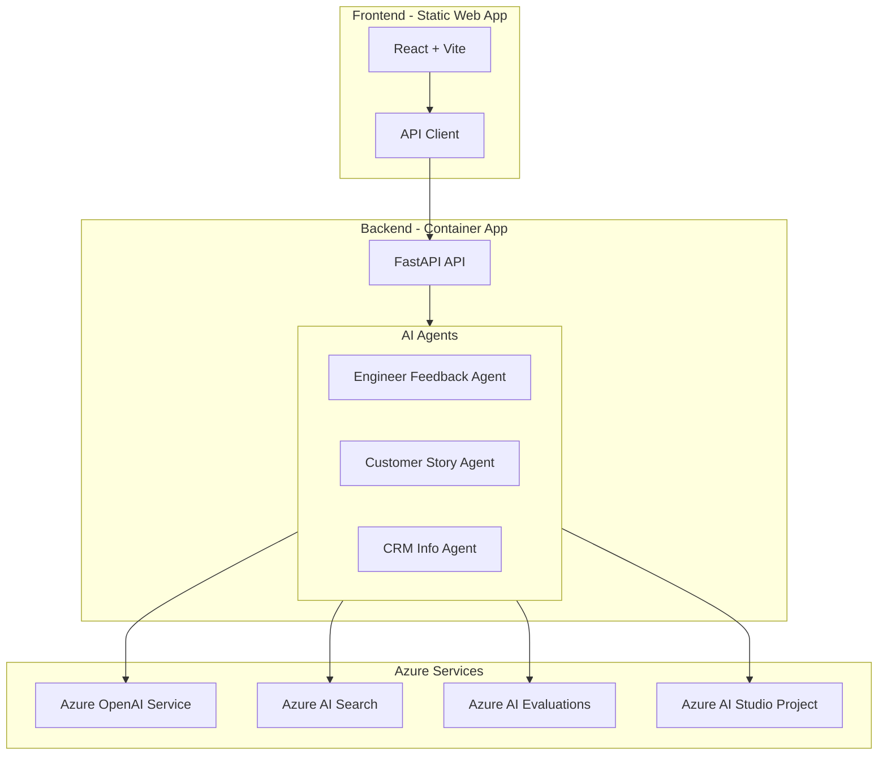

# Sales Copilot Agents

This extends Microsoft 365 Copilot for Sales to transform customer interactions into actionable intelligence. Built on Azure AI services, this solution expertly analyzes customer feedback, extracts engineering insights, and crafts compelling customer stories. As an Azure Developer CLI (azd) solution template, it provides a production-ready foundation for developing intelligent agents with Azure AI Foundry.

## Architecture



## Features
- **AI-powered Analysis**: Leverages Azure OpenAI Service for advanced language processing
- **Multi-Agent System**:
  - Engineering Feedback Agent: Technical analysis and implementation insights
  - Customer Story Agent: Narrative extraction and key points
  - CRM Info Agent: Employee context and background
- **Azure Integration**:
  - Azure AI Search for efficient information retrieval
  - Azure AI Evaluations for quality assessment
  - Azure AI Studio Project for seamless development
- **Modern Tech Stack**:
  - Frontend: Vite + React + TypeScript + crm/ui
  - Backend: FastAPI with async support
  - Infrastructure: Azure Developer CLI (azd)

## Usage

### Input Format
```json
{
  "transcript": "...", // Teams transcript (text or base64)
  "notes": "...",      // Raw notes (text or base64)
  "crmId": "..."       // CRM ID
}
```

### Expected Output
```json
{
  "engineer_feedback": "Technical analysis and implementation insights...",
  "customer_story": "Extracted customer narrative and key points...",
  "crm_context": "Relevant employee context and background..."
}
```

## Local Development

1. **Prerequisites**
   - Node.js 18+
   - Python 3.12+
   - Azure CLI
   - Azure Developer CLI (azd)

2. **Environment Setup**
   ```bash
   # Clone the repository
   git clone https://github.com/yourusername/sales-copilot-agents.git
   cd sales-copilot-agents

   # Install dependencies
   cd src/frontend && npm install
   cd ../api && python -m venv .venv
   source .venv/bin/activate  # or `.venv\Scripts\activate` on Windows
   pip install -r requirements.txt
   ```

3. **Configuration**
   ```bash
   # Create .env file
   cp .env.example .env
   # Edit .env with your Azure credentials
   ```

4. **Running Locally**
   ```bash
   # Frontend
   cd src/frontend
   npm run dev

   # Backend
   cd src/api
   uvicorn main:app --reload
   ```

## Deployment

Deploy using Azure Developer CLI:

```bash
# Initialize and deploy all services
azd up

# Deploy individual services
azd deploy api     # Deploy backend
azd deploy frontend # Deploy frontend
```

### Required Azure Resources
- Azure Container Apps (backend)
- Azure Static Web Apps (frontend)
- Azure OpenAI Service
- Azure AI Search
- Azure Key Vault
- Azure Monitor

## Contributing

1. Fork the repository
2. Create your feature branch (`git checkout -b feature/amazing-feature`)
3. Install pre-commit hooks (`pre-commit install`)
4. Commit your changes (`git commit -m 'feat: Add amazing feature'`)
5. Push to the branch (`git push origin feature/amazing-feature`)
6. Open a Pull Request

### Development Guidelines
- Follow [Conventional Commits](https://www.conventionalcommits.org/)
- Use pre-commit hooks for code quality
- Write tests for new features
- Update documentation as needed

## License
This project is licensed under the MIT License - see the [LICENSE](LICENSE) file for details.
